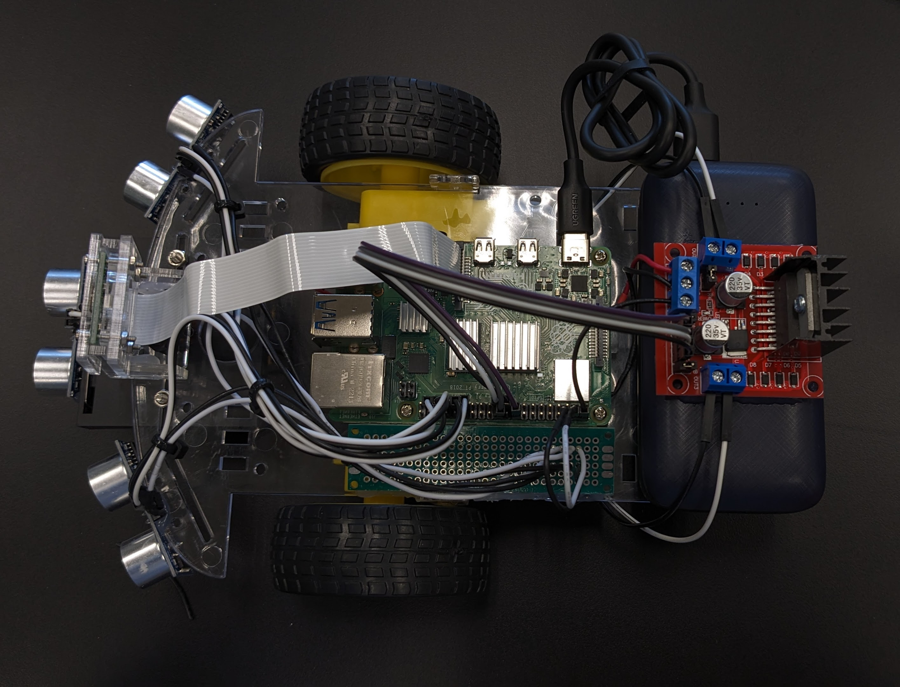

<!--
Replace this text with a brief description (2-3 sentences) of your project. This description should draw the reader in and make them interested in what you've built. You can include what the biggest challenges, takeaways, and triumphs from completing the project were. As you complete your portfolio, remember your audience is less familiar than you are with all that your project entails!
-->

| **Engineer** | **School** | **Area of Interest** | **Grade** |
|:--:|:--:|:--:|:--:|
| Nikolas M | Monta Vista High School | Computer Science | Incoming Senior

<!--
**Replace the BlueStamp logo below with an image of yourself and your completed project. Follow the guide [here](https://tomcam.github.io/least-github-pages/adding-images-github-pages-site.html) if you need help.**
-->
 
 

 
# Demo Video
<video align = "center" src="DemoVideo.mp4" controls muted width="99%"></video>
 

  
# Final Milestone
## Summary
As my final milestone, I added an on/off switch to turn on and off my motors and an LED matrix to display the distance in centimeters that the vehicle detects the ball.

<pre style="background:#fdfdfd; border:none">
Included componenets:
  - Raspberry Pi              > Computer to control camera, motors, and sensors
  - Bread Board               > Provide connection to multiple wires 
  - Ultrasonic Sensors        > Senses how far an object is
  - Camera                    > Provides video output
  - Portable Battery          > Gives power to Raspberry Pi
  - External Battery          > Gives power to the 2 motors
  - DC Stepper Motor Driver   > Allows for control of the 2 motors 
  - 2 DC Motors               > Converts electrical energy passed through the circuit into mechanical energy
  - 2 Wheels                  > Uses mechanical energy to move the vehicle
  - Wires                     > Provide connection between all components
  - Resistors                 > Resists the electrical current
  - LED Matrix                > A grid of LEDs where each LED can be programmed
  - On/Off Switch             > Allows/stops electrical current when pushed on/off respectively
</pre>

In my final milestone, I soldered all of the components to the circuit board. On one of the sides on the circuit board, there was 5 volts of current from the raspberry pi to power the ultrasonic sensors and LED matrix. On the other side of the circuit board, there was 9 volts of current from the battery pack with a on/off switch which turned the current on and off. The motor driver was connected to this 9 volts of current as well as the ground to power the two motors. Finally, the ultrasonic sensors, LED matrix, and motors were controlled through the GPIO pins on the raspberry pi.

 
## Progress

My customization during this milestone was adding the on/off switch for the motors and the LED matrix to display the distance that the camera detects from the ball. I also 3D printed a raspberry pi camera case where the angle is able to be adjusted to point correctly towards the ball.

 
## Challenges
A challenge I faced when creating this robot was getting a component to display the distance that the camera detected the ball, whether it was an lcd screen, oled screen, or LED matrix. At first I tried to get the lcd and oled screen to work, however, I was unable to detect the address of each of the screens through the I2C connection in order to control it. In the end I wasn't able to figure out why the raspberry pi could not detect the components so I decided to use an SPI connection with an LED matrix to display the distance. To control the LED matrix, I used the luma library which was able to draw numbers and text by turning on individual LEDs.
  
Another challenge I came across was accidentally soldering the resistors and wires 1 pin apart from each other so there was no connection between them for current to flow through. This resulted in one of the ultrasonic sensors not working. I was able to fix this issue by putting a very small wire between the two connections and soldering both sides on to each of the contact points. 

 
## Code
<pre style="background:#fdfdfd; border:none; height:40pc">
# import the necessary packages
from picamera.array import PiRGBArray     #As there is a resolution problem in raspberry pi, will not be able to capture frames by VideoCapture
from picamera import PiCamera
import RPi.GPIO as GPIO
import time
import cv2
import numpy as np
import VehicleMove
import Sensor

from luma.core.interface.serial import spi, noop
from luma.core.render import canvas
from luma.core.virtual import viewport
from luma.led_matrix.device import max7219
from luma.core.legacy import text, show_message
from luma.core.legacy.font import proportional, CP437_FONT, LCD_FONT

#Constants
FOCAL = 220 # camera focal length
WIDTH_BALL = 5.5 # width of ball

#hardware work
GPIO.setmode(GPIO.BOARD)
GPIO.setwarnings(False)

#Sensor initialization
leftSensor = Sensor.Sensor(40, 33)
centerSensor = Sensor.Sensor(38, 31)
rightSensor = Sensor.Sensor(36, 29)

#Motor initialization
vehicle = VehicleMove.VehicleMove()
GPIO.setup(26, GPIO.OUT) #PWMA
GPIO.setup(22, GPIO.OUT) #PWMB
left = GPIO.PWM(26, 100)
left.start(50)
left.ChangeDutyCycle(25)
right = GPIO.PWM(22, 100)
right.start(50)
right.ChangeDutyCycle(50)

#LED matrix initialization
serial = spi(port=0, device=0, gpio=noop())
device = max7219(serial, width=16, height=8, block_orientation=-90)
device.contrast(40)
virtual = viewport(device, width=32, height=16)
     
#Image analysis work
def segment_colour(frame):    #returns only the red colors in the frame
    hsv_roi =  cv2.cvtColor(frame, cv2.COLOR_BGR2HSV)
    mask_1 = cv2.inRange(hsv_roi, np.array([160, 160,10]), np.array([190,255,255]))
    ycr_roi=cv2.cvtColor(frame,cv2.COLOR_BGR2YCrCb)
    mask_2=cv2.inRange(ycr_roi, np.array((0.,165.,0.)), np.array((255.,255.,255.)))

    mask = mask_1 | mask_2
    kern_dilate = np.ones((8,8),np.uint8)
    kern_erode  = np.ones((3,3),np.uint8)
    mask= cv2.erode(mask,kern_erode)      #Eroding
    mask=cv2.dilate(mask,kern_dilate)     #Dilating
    cv2.imshow('mask',mask)
    return mask

def find_blob(blob): #returns the red colored circle
    largest_contour=0
    cont_index=0
    contours, hierarchy = cv2.findContours(blob, cv2.RETR_CCOMP, cv2.CHAIN_APPROX_SIMPLE)
    for idx, contour in enumerate(contours):
        area=cv2.contourArea(contour)
        if (area >largest_contour) :
            largest_contour=area
           
            cont_index=idx
            #if res>15 and res<18:
            #    cont_index=idx
                              
    r=(0,0,2,2)
    if len(contours) > 0:
        r = cv2.boundingRect(contours[cont_index])
       
    return r,largest_contour

def target_hist(frame):
    hsv_img=cv2.cvtColor(frame, cv2.COLOR_BGR2HSV)
   
    hist=cv2.calcHist([hsv_img],[0],None,[50],[0,255])
    return hist
    
def draw(distance):
    #print("Distance:", round(distance))
    with canvas(device) as draw:
        if (distance == 0):
            device.clear()
        else:
            if distance < 10:
                text(draw, (1, 1), str(round(distance)), fill="white")
            else:
                text(draw, (1, 1), str(round(distance) / 10), fill="white")
                text(draw, (9, 1), str(round(distance) % 10), fill="white")

# Take input from webcam
cap = cv2.VideoCapture(0) # 640x480

# Reduce the size of video to 320x240 so rpi can process faster
cap.set(3,320)
cap.set(4,240)
 
# allow the camera to warmup
time.sleep(0.001)
 
# capture frames from the camera
while True:
      _, frame = cap.read() # Read image frames from live video feed
      frame=cv2.flip(frame,1)
      global centre_x
      global centre_y
      centre_x=0.
      centre_y=0.
      hsv1 = cv2.cvtColor(frame, cv2.COLOR_BGR2HSV)
      mask_red=segment_colour(frame)      #masking red the frame
      loct,area=find_blob(mask_red)
      global x,y,w,h
      x,y,w,h=loct
     
      #distance coming from front ultrasonic sensor
      distanceC = centerSensor.distance()
      #distance coming from right ultrasonic sensor
      distanceR = rightSensor.distance()
      #distance coming from left ultrasonic sensor
      distanceL = leftSensor.distance()
             
      if (w*h) < 500:
            found=0
      else:
            found=1
            simg2 = cv2.rectangle(frame, (x,y), (x+w,y+h), 255,2)
            centre_x=x+((w)/2)
            centre_y=y+((h)/2)
            cv2.circle(frame,(int(centre_x),int(centre_y)),3,(0,110,255),-1)
            centre_x-=80
            centre_y=6--centre_y
            print(centre_x,centre_y)
      flag=0        
      if(found==0):
            #if the ball is not found and the last time it sees ball in which direction, it will start to rotate in that direction
            if flag==0:
                  vehicle.rightTurn()
                  time.sleep(0.1)
            else:
                  vehicle.leftTurn()
                  time.sleep(0.1)
            vehicle.stop()
            time.sleep(0.0125)
     
      elif(found==1):
            threshold=20000
            if(area < threshold):
                  if(distanceC > 3 and distanceR > 3 and distanceL > 3):
                        #it brings coordinates of ball to center of camera's imaginary axis.
                        if(centre_x<=20 or centre_x>=130):
                              if(centre_x<20):
                                    flag=0
                                    vehicle.rightTurn()
                                    if (centre_x < -10):
                                          time.sleep(0.1)
                                    time.sleep(0.05)
                                    vehicle.stop()
                                    time.sleep(0.01)
                              elif(centre_x>130):
                                    flag=1
                                    vehicle.leftTurn()
                                    if (centre_x > 160):
                                          time.sleep(0.1)
                                    time.sleep(0.05)
                                    vehicle.stop()
                                    time.sleep(0.01)
                        else:
                              vehicle.forward()
                              time.sleep(0.1)
                        time.sleep(0.01)
                  else:
                        vehicle.stop()
                        time.sleep(0.01)

            else:
                  vehicle.backward()
                  time.sleep(0.1)
      cv2.imshow("draw",frame)  
      
      distance = min(min(distanceC, distanceL), distanceR)
      if (found == 0):
            distance = 0
      draw(distance)  
      
      time.sleep(0.1)
      if(cv2.waitKey(1) & 0xff == ord('q')):
            break

GPIO.cleanup() #free all the GPIO pins
</pre>

   
# Second Milestone
<iframe width="560" height="315" src="https://www.youtube.com/embed/ot4ZATjNglQ" title="YouTube video player" frameborder="0" allow="accelerometer; autoplay; clipboard-write; encrypted-media; gyroscope; picture-in-picture; web-share" allowfullscreen></iframe>
## Summary
As my second milestone, I coded the ball tracking component of the robot.

<pre style="background:#fdfdfd; border:none">
Included componenets:
  - Raspberry Pi              > Computer to control camera, motors, and sensors
  - Bread Board               > Provide connection to multiple wires 
  - Ultrasonic Sensors        > Senses how far an object is
  - Camera                    > Provides video output
  - Portable Battery          > Gives power to Raspberry Pi
  - External Battery          > Gives power to the 2 motors
  - DC Stepper Motor Driver   > Allows for control of the 2 motors 
  - 2 DC Motors               > Converts electrical energy passed through the circuit into mechanical energy
  - 2 Wheels                  > Uses mechanical energy to move the vehicle
  - Wires                     > Provide connection between all components
  - Resistors                 > Resists the electrical current
</pre>

  

In my second milestone, I added a voltage divider for each of the ultrasonic sensors in order to send only 3.3 volts back to the raspberry pi GPIO pin from the echo pin on the sensor. In my voltage divider I used two resistors, a 1k Ohm resistor above the output wire and a 2k Ohm resistor below the output wire. The 2k Ohm resistor below the wire is connected to ground and the echo pin provides current to the 1k Ohm resistor, thus creating the circuit.

 
## Progress
 
I was able to get the robot to track the ball by creating a mask that filtered all the ball colors to white and everything else to black. Then using the openCV HoughCircles() function, I was able to search for circles in the mask and move the vehicle towards the ball.

 
## Challenges
A challenge I faced when creating this robot was my raspberry pi short circuiting when using my ultrasonic sensors. My raspberry pi short circuited because the echo pin on the ultrasonic sensor was sending back 5 volts to the raspberry pi's GPIO pin when the GPIO pin only took 3.3 volts. My solution to this challenge was to implement a voltage divider than limited the voltage sent back from the echo pin to 3.3 volts by using resistors and a bread board.

 
## Next Steps
My next steps are to implement modifications to the robot such as adding an LCD screen to display how far the ball is.

 
## Code
<pre style="background:#fdfdfd; border:none; height:40pc">
import RPi.GPIO as GPIO
import time
import subprocess
import cv2
import numpy as np
import math
import VehicleMove

vehicle = VehicleMove.VehicleMove()
start_time_prog = time.time()

# Set GPIO channels
GPIO.setmode(GPIO.BOARD)
GPIO.setup(24, GPIO.OUT) #PWMA
GPIO.setup(26, GPIO.OUT) #PWMB

# Motor initialization
left = GPIO.PWM(24, 100)
left.start(50)
right = GPIO.PWM(26, 100)
right.start(50)

# Robot mode variables
# 0 = stop, 1 = ball tracking, 2 = manual forward, 3 = manual backward
# 0 can be called anytime. 1, 2, and 3 can only be called from 0
global robot_mode
robot_mode = 1
global prev_robot_mode
prev_robot_mode = 1
global run #Program run flag
run = 1
global start #If start program
start = 0
ball_detected = 0 #If track the ball

# Constants
KERNEL_MORPH_BALL = np.ones((3,3),np.uint8)
KERNEL_MORPH_HAND = np.ones((4,4),np.uint8)
FOCAL = 220 # camera focal length
WIDTH_BALL = 3.35 # width of ball

# HSV threshold of ball
# Need to be adjusted depending on camera exposure and environment
# Detect based on ball color
lower_ball = (160, 160, 10)#(22, 30, 0)
upper_ball = (190, 255, 255)#(40, 255, 113)

# variables and list for functionalities
ball_x = [] # x axis coordinate of ball center
ball_rad = [] # Radius of ball center
dist_x = 0 # Pixel coordinate of ball center
dist_rad = 0 # Pixel radius of circle
defects_list = []
ball_last_detected = time.time()
ball_first_detected = 0
ball_verify = 0
motor_time = 0
mask_ball = 0

# Variables for modes and motor control
finger = 0 # Number for stop state
dist_calc = 0 # Distance of ball from camera in cm
dist_l = 0 # Pixel distance of circle from left of camera view
dist_r = 0 # Pixel distance of circle from right of camera view
dist_l_pre = 0 # Previous pixel distance of circle from left of camera view
dist_r_pre = 0 # Previous pixel distance of circle from right of camera view
left_speed = 0
right_speed = 0

# Take input from webcam
cap = cv2.VideoCapture(0) # 640x480

# Reduce the size of video to 320x240 so rpi can process faster
cap.set(3,320)
cap.set(4,240)

# Distance average function for ball tracking
def average_distance(distance_list, length): 
    total = 0
    for i in distance_list:
        total += i
    return total / length
    
def average_defects(defects_list):
    return
    
# Ball tracking function
def ball_track():
    global mask_ball, ball_x, ball_rad, dist_x, dist_l, dist_r, dist_rad, dist_calc, ball_detected, ball_last_detected, ball_first_detected, ball_verify
    
    blurred = cv2.GaussianBlur(frame, (7, 7), 0)
    hsv = cv2.cvtColor(blurred, cv2.COLOR_BGR2HSV)

    mask_ball = cv2.inRange(hsv, lower_ball, upper_ball)
    mask_ball = cv2.erode(mask_ball, KERNEL_MORPH_BALL, iterations=2)
    mask_ball = cv2.dilate(mask_ball, KERNEL_MORPH_BALL, iterations=5)
    mask_ball = cv2.GaussianBlur(mask_ball,(11,11),0)

    # Detect circles using HoughCircles
    # param is threshold of size of circle
    # If param2 is low, more sensitive to small circles and false positive
    circles = cv2.HoughCircles(mask_ball,cv2.HOUGH_GRADIENT,2,120,param1=100,param2=60,minRadius=2,maxRadius=0)     

    #Draw Circles
    if circles is not None:
        # If ball was previously not detected
        if ball_detected == 0 and ball_verify == 0:
            ball_first_detected = time.time()
            ball_verify = 1
        if ball_verify == 1 and (time.time() - ball_first_detected) > 0.1: # Verification after .1 second passes, ball still detected
            ball_detected = 1
            ball_verify = 0
        if ball_detected == 1:    
            ball_last_detected = time.time() # Update last detected time of the ball
            for i in circles[0,:]:
                cv2.circle(frame,(int(round(i[0])),int(round(i[1]))),int(round(i[2])),(0,255,0),5) # x is 320 y is 240, draw circle  
                ball_x.append(round(i[0])) # Append x center coordinate to list
                ball_rad.append(round(i[2])) # Append radius to list
                
                # Average every 4 entries
                if len(ball_x) == 4: 
                    dist_x = average_distance(ball_x, 4) # x coordinate of ball center
                    ball_x = []
                    
                    # Calculated distance of ball from camera
                    dist_rad = average_distance(ball_rad, 4) 
                    dist_calc = WIDTH_BALL * FOCAL / dist_rad
                    ball_rad = []
                    
                    # For output to control algorithm
                    dist_r = round(320 - (dist_x + dist_rad), 2)
                    dist_l = round(dist_x - dist_rad, 2)
                
                    # Focal distance calculation
                    # focal = (dist_ave * 25.4 / 3.35) # in pixels and cm
    else:
        if ball_verify == 1: # During ball dection verification process, if ball is lost means false positive
            ball_verify = 0
        
        ball_lost_time = time.time() - ball_last_detected
        dist_calc = 0 # Reset ball distance
        
        # maybe use ball lost time for rotate, but immediately set ball_detected = 0
        if ball_detected == 1 and ball_lost_time > 2: # If ball has been missing for > 2 seconds
            ball_detected = 0 # Ball is not detected / not in frame -> need to find ball
            
# Motor movement function
def rotate():
    left.ChangeDutyCycle(27)
    right.ChangeDutyCycle(27)
    vehicle.rightTurn()
    
def forward():
    if robot_mode == 2:
        left.ChangeDutyCycle(40)
        right.ChangeDutyCycle(40)
    vehicle.forward()

def backward():
    left.ChangeDutyCycle(40)
    right.ChangeDutyCycle(40)
    vehicle.backward()
    
def stop():
    vehicle.stop()

# Set motor speed function
def set_speed():
    global dist_l_pre, dist_r_pre, left_speed, right_speed, motor_time
    
    k_p = 0.05
    k_i = 0
    k_d = 0
    #d_time = time.time() - motor_time
    if dist_calc > 15:
        if dist_calc > 25:
            k = 35
        else:
            k = 25    
        vehicle.forward()
        
        left_speed = k + k_p * dist_r #+ k_d * ((dist_r - dist_r_pre) / d_time)
        right_speed = k + k_p * dist_l #+ k_d * ((dist_l - dist_l_pre) / d_time)

        left.ChangeDutyCycle(left_speed + 50)
        right.ChangeDutyCycle(right_speed + 50)        

    elif dist_calc > 8: # between 8 and 13, re-center only
        left.ChangeDutyCycle(40)
        right.ChangeDutyCycle(40)
        if dist_l + 40 < dist_r: # If ball is a bit right, do clockwise
            vehicle.rightTurn()
        elif dist_r + 40 < dist_l: # If ball is a bit right, do counter-clockwise
            vehicle.leftTurn()
        else: # Stop moving
            vehicle.stop()
            
            
    else: # When ball is close
        left_speed = 0
        right_speed = 0
        left.ChangeDutyCycle(left_speed)
        right.ChangeDutyCycle(right_speed)

#Main loop
while run:
    start_loop = time.time()
    _, frame = cap.read() # Read image frames from live video feed
    
    if robot_mode == 1: # Ball tracking
        ball_track()
        if ball_detected:
            forward()
            set_speed()
            dist_l_pre = dist_l
            dist_r_pre = dist_r
        else:
            rotate()
    
    
    # Video display
    cv2.imshow('tracking',frame)
    cv2.imshow('Ball mask',mask_ball)  
    

    # Program imeout
    if (time.time() - start_time_prog) > 300: 
        run = False
    
    k = cv2.waitKey(5) & 0xFF
    if k == 27:
        break

stop()
GPIO.cleanup()
cap.release()
cv2.destroyAllWindows()
</pre>

   
# First Milestone
<iframe width="560" height="315" src="https://www.youtube.com/embed/XBj6bCdopuY" title="YouTube video player" frameborder="0" allow="accelerometer; autoplay; clipboard-write; encrypted-media; gyroscope; picture-in-picture; web-share" allowfullscreen></iframe>
## Summary
As my first milestone, I created the shell of the robot without the ball tracking component. 

<pre style="background:#fdfdfd; border:none">
Included componenets:
  - Raspberry Pi              > Computer to control camera, motors, and sensors
  - Circuit Board             > Provide connection to multiple wires 
  - Ultrasonic Sensors        > Senses how far an object is
  - Camera                    > Provides video output
  - Portable Battery          > Gives power to Raspberry Pi
  - External Batteries        > Gives power to the 2 motors
  - DC Stepper Motor Driver   > Allows for control of the 2 motors 
  - 2 DC Motors               > Converts electrical energy passed through the circuit into mechanical energy
  - 2 Wheels                  > Uses mechanical energy to move the vehicle
  - Wires                     > Provide connection between all components
</pre>

  

These components work together by being connected through the raspberry pi, circuit board, and dc stepper motor driver. The portable battery provides power to the raspberry pi and the raspberry pi and external batteries provide power to the dc stepper motor driver. The raspberry pi also is connected to the dc stepper motor driver with 4 GPIO pins which can be programmed to make specific motors move. The dc stepper motor driver provides output cables to the two motors. The raspberry pi also provides power through the circuit board to the 3 ultrasonic sensors. In addition to this, 2 GPIO pins from the raspberry pi (in and out) are connected to each ultrasonic sensor to control it. Finally, the camera is connected to the raspberry pi through the camera slot.

 
## Progress
I was able to get the robot to show video output, sense how far away an object is in centimeters, and move on command from input from a keyboard.

 
## Challenges
A challenge I faced when creating this robot was learning how to use the RPi.GPIO library correctly to control the motors and sensors. As I created multiple classes for the motors and movement, when I tried to close the motor connection in one of these classes after use, it would always throw an error. The fix to this issue was to always close the connection of the motors in the main class that created objects of the Motor and VehicleMovement classes. 

 
## Next Steps
My next steps are to implement the ball tracking mechanism of the robot and move towards the ball when it detects one.

 
## Code
<pre style="background:#fdfdfd; border:none; height:40pc">
<table>
<tr>
<th> Main.py </th>
<th> VehicleMovement.py </th>
<th> Motor.py </th>
</tr>
<tr>
<td style="vertical-align:top">

<pre style="background:#f7f7f7; border:none">
from picamera.array import PiRGBArray
from picamera import PiCamera
import time
import RPi.GPIO as GPIO
import Motor
import VehicleMove

camera = PiCamera()
vehicle = VehicleMove.VehicleMove()

value = "w"
while (value != "q"):
    value = input("enter: ")
    if (value == "w"):
        vehicle.forward()
    elif (value == "s"):
        vehicle.backward()
    elif (value == "d"):
        vehicle.rightTurn()
    elif (value == "a"):
        vehicle.leftTurn()
    elif (value == "e"):
        vehicle.stop()
    elif (value == "z"):
        camera.start_preview(alpha=200)
    elif (value == "x"):
        camera.stop_preview()
    else:
        vehicle.stop()
        GPIO.cleanup()
</pre>

</td>
<td style="vertical-align:top">

<pre style="background:#f7f7f7; border:none">
import Motor
class VehicleMove:
    def __init__(self):
        self.rightMotor = Motor.Motor(22, 18)
        self.leftMotor = Motor.Motor(21, 19)
        
    def forward(self):
        print("forward")
        self.rightMotor.forward()
        self.leftMotor.forward()
        
    def backward(self):
        print("backward")
        self.rightMotor.backward()
        self.leftMotor.backward()
        
    def rightTurn(self):
        print("rightTurn")
        self.rightMotor.backward()
        self.leftMotor.forward()
        
    def leftTurn(self):
        print("leftTurn")
        self.rightMotor.forward()
        self.leftMotor.backward()

    def stop(self):
        print("stop")
        self.rightMotor.stop()
        self.leftMotor.stop()
</pre>

</td>
<td style="vertical-align:top">

<pre style="background:#f7f7f7; border:none">
import RPi.GPIO as GPIO
class Motor:
    def __init__(self, pinIn, pinOut):
        self.pinIn = pinIn
        self.pinOut = pinOut
        
        GPIO.setmode(GPIO.BOARD)
        GPIO.setup(self.pinIn, GPIO.OUT)
        GPIO.setup(self.pinOut, GPIO.OUT)
    
    def forward(self):
        GPIO.output(self.pinIn, True)
        GPIO.output(self.pinOut, False)
        
    def backward(self):
        GPIO.output(self.pinIn, False)
        GPIO.output(self.pinOut, True)
        
    def stop(self):
        GPIO.output(self.pinIn, False)
        GPIO.output(self.pinOut, False)
</pre>

</td>
</tr>
</table>
</pre>

<!--
For your first milestone, describe what your project is and how you plan to build it. You can include:
- An explanation about the different components of your project and how they will all integrate together
- Technical progress you've made so far
- Challenges you're facing and solving in your future milestones
- What your plan is to complete your project
-->

   
# Starter Project - Useless Box
<iframe width="560" height="315" src="https://www.youtube.com/embed/p0D7MX5DmcY" title="YouTube video player" frameborder="0" allow="accelerometer; autoplay; clipboard-write; encrypted-media; gyroscope; picture-in-picture; web-share" allowfullscreen></iframe>
## Summary
As my starter project, I created a useless box that flicks a lever off after it is flicked on. This is done by a motor that is attached to an arm in the machine that activates when a lever is flicked on. In addition to this, there is also an LED hooked up to the circuit which turns green when the arm is starting to flick the lever back and turns red after the arm has flicked the lever. 

<pre style="background:#fdfdfd; border:none">
Included components:
  - Lever             > Switch that can turn on and off a circuit
  - LED               > Light-emmiting diode
  - Resistor          > Resists the voltage in a circuit
  - Pressure Switch   > Switch that can be turned on and off through pressure
  - Motor             > Converts electrical energy passed through the circuit into mechanical energy
  - Batteries         > Gives power to the circuit
  - Circuit Board     > Where components are soldered onto to create a circuit
</pre>

  

These components work together by being interconnected by the circuit board. When the lever is switched on, power is sent to the motor a resistor making the motor to move the arm up towards the lever. When the arm starts to move it decreases the pressure applied on the pressure switch causing the switch to turn on and send power through the resistor to the LED, turning it green. Then after the lever is flicked off by the arm, the LED changes color to RED and the motor changes its direction moving the arm down. When the arm comes to a stop, it puts pressure back onto the pressure switch, turning off the LED.

 
## Challenges
I encountered a challenge with the self-tapping screws (meaning that the screw creates its own rivets) when the screws kept getting stuck. To combat this challenge I had to come up with my own idea to which I used a wrench as a leveraging tool to help me unscrew the screws that were stuck.

 
## Next Steps
My next steps are to start work on my intensive project which is a ball tracking robot. I plan to start this project and apply the knowledge of soldering I learnt from the starter project to the ball tracking robot.

   
# Schematics 

   
# Full Code
<pre style="background:#fdfdfd; border:none; height:40pc">
<table>
<tr>
<th> BallTracking.py </th>
<th> VehicleMovement.py </th>
<th> Motor.py </th>
<th> Sensor.py </th>
</tr>
<tr>
<td style="vertical-align:top">

<pre style="background:#f7f7f7; border:none">
# import the necessary packages
import RPi.GPIO as GPIO
import time
import cv2
import numpy as np
import VehicleMove
import Sensor

from luma.core.interface.serial import spi, noop
from luma.core.render import canvas
from luma.core.virtual import viewport
from luma.led_matrix.device import max7219
from luma.core.legacy import text, show_message
from luma.core.legacy.font import proportional, CP437_FONT, LCD_FONT

#Constants
FOCAL = 220 # camera focal length
WIDTH_BALL = 5.5 # width of ball

#hardware work
GPIO.setmode(GPIO.BOARD)
GPIO.setwarnings(False)

#Sensor initialization
leftSensor = Sensor.Sensor(40, 33)
centerSensor = Sensor.Sensor(38, 31)
rightSensor = Sensor.Sensor(36, 29)

#Motor initialization
vehicle = VehicleMove.VehicleMove()
GPIO.setup(26, GPIO.OUT) #PWMA
GPIO.setup(22, GPIO.OUT) #PWMB
left = GPIO.PWM(26, 100)
left.start(50)
left.ChangeDutyCycle(25)
right = GPIO.PWM(22, 100)
right.start(50)
right.ChangeDutyCycle(70)

#LED matrix initialization
serial = spi(port=0, device=0, gpio=noop())
device = max7219(serial, width=16, height=8, block_orientation=-90)
device.contrast(40)
virtual = viewport(device, width=32, height=16)
     
#Image analysis work
def segment_colour(frame):    #returns only the red colors in the frame
    hsv_roi =  cv2.cvtColor(frame, cv2.COLOR_BGR2HSV)
    mask_1 = cv2.inRange(hsv_roi, np.array([160, 160,10]), np.array([190,255,255]))
    ycr_roi=cv2.cvtColor(frame,cv2.COLOR_BGR2YCrCb)
    mask_2=cv2.inRange(ycr_roi, np.array((0.,165.,0.)), np.array((255.,255.,255.)))

    mask = mask_1 | mask_2
    kern_dilate = np.ones((8,8),np.uint8)
    kern_erode  = np.ones((3,3),np.uint8)
    mask= cv2.erode(mask,kern_erode)      #Eroding
    mask=cv2.dilate(mask,kern_dilate)     #Dilating
    cv2.imshow('mask',mask)
    return mask

def find_blob(blob): #returns the red colored circle
    largest_contour=0
    cont_index=0
    contours, hierarchy = cv2.findContours(blob, cv2.RETR_CCOMP, cv2.CHAIN_APPROX_SIMPLE)
    for idx, contour in enumerate(contours):
        area=cv2.contourArea(contour)
        if (area >largest_contour) :
            largest_contour=area
           
            cont_index=idx
            #if res>15 and res<18:
            #    cont_index=idx
                              
    r=(0,0,2,2)
    if len(contours) > 0:
        r = cv2.boundingRect(contours[cont_index])
       
    return r,largest_contour

def target_hist(frame):
    hsv_img=cv2.cvtColor(frame, cv2.COLOR_BGR2HSV)
   
    hist=cv2.calcHist([hsv_img],[0],None,[50],[0,255])
    return hist
    
def draw(distance):
    #print("Distance:", round(distance))
    with canvas(device) as draw:
        if (distance == 0):
            device.clear()
        else:
            if distance < 10:
                text(draw, (1, 1), str(round(distance)), fill="white")
            else:
                text(draw, (1, 1), str(round(distance) / 10), fill="white")
                text(draw, (9, 1), str(round(distance) % 10), fill="white")

# Take input from webcam
cap = cv2.VideoCapture(0) # 640x480

# Reduce the size of video to 320x240 so rpi can process faster
cap.set(3,320)
cap.set(4,240)
 
# allow the camera to warmup
time.sleep(0.001)
 
# capture frames from the camera
while True:
      _, frame = cap.read() # Read image frames from live video feed
      frame=cv2.flip(frame,1)
      global centre_x
      global centre_y
      centre_x=0.
      centre_y=0.
      hsv1 = cv2.cvtColor(frame, cv2.COLOR_BGR2HSV)
      mask_red=segment_colour(frame)      #masking red the frame
      loct,area=find_blob(mask_red)
      global x,y,w,h
      x,y,w,h=loct
     
      #distance coming from front ultrasonic sensor
      distanceC = centerSensor.distance()
      #distance coming from right ultrasonic sensor
      distanceR = rightSensor.distance()
      #distance coming from left ultrasonic sensor
      distanceL = leftSensor.distance()
             
      if (w*h) < 500:
            found=0
      else:
            found=1
            simg2 = cv2.rectangle(frame, (x,y), (x+w,y+h), 255,2)
            centre_x=x+((w)/2)
            centre_y=y+((h)/2)
            cv2.circle(frame,(int(centre_x),int(centre_y)),3,(0,110,255),-1)
            centre_x-=80
            centre_y=6--centre_y
            print(centre_x,centre_y)
      flag=0        
      if(found==0):
            #if the ball is not found and the last time it sees ball in which direction, it will start to rotate in that direction
            if flag==0:
                  vehicle.rightTurn()
                  time.sleep(0.1)
            else:
                  vehicle.leftTurn()
                  time.sleep(0.1)
            vehicle.stop()
            time.sleep(0.0125)
     
      elif(found==1):
            threshold=20000
            if(area < threshold):
                  if(distanceC > 3):# and distanceR > 3 and distanceL > 3):
                        #it brings coordinates of ball to center of camera's imaginary axis.
                        if(centre_x<=20 or centre_x>=130):
                              if(centre_x<20):
                                    flag=0
                                    vehicle.rightTurn()
                                    if (centre_x < -10):
                                          time.sleep(0.1)
                                    time.sleep(0.05)
                                    vehicle.stop()
                                    time.sleep(0.01)
                              elif(centre_x>130):
                                    flag=1
                                    vehicle.leftTurn()
                                    if (centre_x > 160):
                                          time.sleep(0.1)
                                    time.sleep(0.05)
                                    vehicle.stop()
                                    time.sleep(0.01)
                        else:
                              vehicle.forward()
                              time.sleep(0.1)
                        time.sleep(0.01)
                  else:
                        vehicle.stop()
                        time.sleep(0.01)

            else:
                  vehicle.backward()
                  time.sleep(0.1)
      cv2.imshow("draw",frame)  
      
      distance = min(min(distanceC, distanceL), distanceR)
      if (found == 0):
            distance = 0
      draw(distance)  
      
      time.sleep(0.1)
      if(cv2.waitKey(1) & 0xff == ord('q')):
            break

GPIO.cleanup() #free all the GPIO pins
</pre>

</td>
<td style="vertical-align:top">

<pre style="background:#f7f7f7; border:none">
import Motor
import RPi.GPIO as GPIO
class VehicleMove:
    def __init__(self):
        self.leftMotor = Motor.Motor(15, 18)
        self.rightMotor = Motor.Motor(21, 16)
        
    def forward(self):
        print("forward")
        self.rightMotor.forward()
        self.leftMotor.forward()
        
    def backward(self):
        print("backward")
        self.rightMotor.backward()
        self.leftMotor.backward()
        
    def rightTurn(self):
        print("rightTurn")
        self.rightMotor.backward()
        self.leftMotor.forward()
        
    def leftTurn(self):
        print("leftTurn")
        self.rightMotor.forward()
        self.leftMotor.backward()

    def stop(self):
        print("stop")
        self.rightMotor.stop()
        self.leftMotor.stop()
</pre>

</td>
<td style="vertical-align:top">

<pre style="background:#f7f7f7; border:none">
import RPi.GPIO as GPIO
class Motor:
    def __init__(self, pinIn, pinOut):
        self.pinIn = pinIn
        self.pinOut = pinOut
        
        GPIO.setmode(GPIO.BOARD)
        GPIO.setup(self.pinIn, GPIO.OUT)
        GPIO.setup(self.pinOut, GPIO.OUT)
    
    def forward(self):
        GPIO.output(self.pinIn, True)
        GPIO.output(self.pinOut, False)
        
    def backward(self):
        GPIO.output(self.pinIn, False)
        GPIO.output(self.pinOut, True)
        
    def stop(self):
        GPIO.output(self.pinIn, False)
        GPIO.output(self.pinOut, False)
</pre>

</td>
<td style="vertical-align:top">

<pre style="background:#f7f7f7; border:none">
import RPi.GPIO as GPIO
import time
class Sensor:
	def __init__(self, trig, echo):
		self.trig = trig
		self.echo = echo
		
		GPIO.setmode(GPIO.BOARD)
		GPIO.setup(self.trig, GPIO.OUT)
		GPIO.setup(self.echo, GPIO.IN)
		
	def distance(self):
		GPIO.output(self.trig, True)
		time.sleep(0.00001)
		GPIO.output(self.trig, False)
		
		startTime = time.time()
		stopTime = time.time()
		
		while (GPIO.input(self.echo) == 0):
			startTime = time.time()
		
		while (GPIO.input(self.echo) == 1):
			stopTime = time.time()
			
		timeElapsed = stopTime - startTime
		distance = (timeElapsed * 34300) /2
		
		return distance
</pre>
</td>
</tr>
</table>
</pre>

# Bill of Materials
<!--Here's where you'll list the parts in your project. To add more rows, just copy and paste the example rows below.
Don't forget to place the link of where to buy each component inside the quotation marks in the corresponding row after href =. Follow the guide [here]([url](https://www.markdownguide.org/extended-syntax/)) to learn how to customize this to your project needs. 

| **Part** | **Note** | **Price** | **Link** |
|:--:|:--:|:--:|:--:|
| Item Name | What the item is used for | $Price | <a href="https://www.amazon.com/Arduino-A000066-ARDUINO-UNO-R3/dp/B008GRTSV6/"> Link </a> |
|:--:|:--:|:--:|:--:|
| Item Name | What the item is used for | $Price | <a href="https://www.amazon.com/Arduino-A000066-ARDUINO-UNO-R3/dp/B008GRTSV6/"> Link </a> |
|:--:|:--:|:--:|:--:|
| Item Name | What the item is used for | $Price | <a href="https://www.amazon.com/Arduino-A000066-ARDUINO-UNO-R3/dp/B008GRTSV6/"> Link </a> |
|:--:|:--:|:--:|:--:|

# Other Resources/Examples
One of the best parts about Github is that you can view how other people set up their own work. Here are some past BSE portfolios that are awesome examples. You can view how they set up their portfolio, and you can view their index.md files to understand how they implemented different portfolio components.
- [Example 1](https://trashytuber.github.io/YimingJiaBlueStamp/)
- [Example 2](https://sviatil0.github.io/Sviatoslav_BSE/)
- [Example 3](https://arneshkumar.github.io/arneshbluestamp/)

To watch the BSE tutorial on how to create a portfolio, click here.
-->
